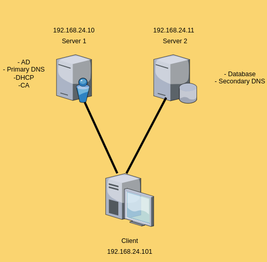

## Korte omschrijving van jouw opstelling
### Een overzicht van jouw opstelling

#### Welke VMs zijn er?
    Server 1 -> windows server 2022 standard core
    Server 2 -> windows server 2022 standard core
    Client -> windows 10 enterprise
#### Welke rollen of software staan er op elke VM?
    Server 1 -> AD DS, DNS, DHCP, Certificate Authority
    Server 2 -> DNS, MS SQL Server
    Client -> RSAT-tools (for DNS, DHCP, AD en CA) , SQL Server Management Studio
#### Een netwerkdiagram voorzien van een korte uitleg

### tabel met IP-adressen en DNS-informatie
|  | Server 1 | Server 2 |Client |
|----------|----------|--------|-------|
| Ip address    | 192.168.24.10      |  192.168.24.11  |VIA DHCP |
| Dns-server     |  /  |   /     |VIA DHCP 192.168.24.10, 192.168.24.11
| Domain     | WS2-2425-gianni.hogent | WS2-2425-gianni.hogent |WS2-2425-gianni.hogent


### Motivatie van jouw beslissingen:

#### Welke rollen nam je samen en waarom?
Bij Server 1 heb ik AD DS, DNS, DHCP en Certificate Authority samen genomen omdat dit alles te maken heeft met het AD.
AD DS DHCP, en DNS werken goed samen omdat DNS nodig is voor domeinfunctionaliteit. De CA kan meestal worden gecombineerd met AD DS op kleinere omgevingen zonder noemenswaardige performanceproblemen.CA is licht qua resources en past goed bij AD omdat het vaak wordt gebruikt voor domein- of gebruikerscertificaten.


Bij Server 2 heb ik een Secundaire DNS  die redundantie biedt voor DNS-resolutie.
MSSQL vraagt meer geheugen en opslag. Het is logisch om MSSQL en secundaire DNS op de tweede server te plaatsen om belasting te spreiden.

#### Waarop heb je je gebaseerd om de resources vast te leggen?
#### Wat kan je eventueel wijzigen indien je meer bronnen ter beschikking zou hebben?

Microsoft-aanbevelingen voor minimale vereisten:

Active Directory Domain Services (AD DS): Minimaal 512MB RAM aanbevolen 2GB of meer afhankelijk van het aantal gebruikers.
DNS:Heeft geen significant eigen RAM-gebruik. 
Certificate Authority (CA): Licht qua resources, 512MB tot 1GB RAM is voldoende voor basisgebruik.
DHCP: Zeer laag resourcegebruik (RAM < 1GB, tenzij het duizenden clients moet bedienen).

SERVER 2
MSSQL Server: Minimaal 2GB RAM aanbevolen voor een basistestomgeving. Voor productie kan dit variëren van 4GB tot 64GB of meer.

Windows Client:

1GB RAM is het minimum voor een basisclient zonder zware applicaties.

##### Aanpassingen bij meer beschikbare bronnen

Dan zou ik elke maschine nog extra ram geven.
Of zelf gebruik maken van een extra server voor applicaties en rollen te scheiden.
Dit zorgt ervoor dat de prestaties en schaalbaarheid verbetert.

### Een korte beschrijving van de problemen die je tegenkwam, en hoe je deze opgelost hebt.

Enkele problemen die ik tegenkwam waren:

- Na het installeren van de SSMS op de client kon ik niet verbinden met de SQL server.
  Dit kwam omdat mijn firewall de verbinding blokkeerde.
  Ik heb dit laten werken door op de firewall poort 1433 toe te voegen en toe te laten zodat het verkeer voor die poort kan paseren.

```ps1
New-NetFirewallRule -DisplayName "Allow SQL Server Inbound TCP 1433" -Direction Inbound -Protocol TCP -LocalPort 1433 -Action Allow
New-NetFirewallRule -DisplayName "Allow SQL Server Outbound TCP 1433" -Direction Outbound -Protocol TCP -LocalPort 1433 -Action Allow
```

- Na het toevoegen van server2 of de client aan het domein kreeg ik vaak het probleem dat ik niet de correcte rechten had om acties uit te voeren.
  Dit loste ik op door in te loggen als de administrator van het domein waardoor ik wel over rechten voor had.

```ps1
ssh "ws2-2425-gianni.hogent\Administrator"@192.168.24.10
```
- Daarnaast had ik ook veel problemen met de juiste commando's te vinden. Hierbij heb ik mij vooral gebasseerd op de documentatie van Microsoft.

### Een korte beschrijving van de huidige status van je project:

#### Wat is volledig afgewerkt?
- De AD DS is volledig geconfigureerd en werkt naar behoren.
- De DNS is volledig geconfigureerd en werkt naar behoren.
- De DHCP is volledig geconfigureerd en werkt naar behoren.
- De Certificate Authority is volledig geconfigureerd en werkt naar behoren.
- De MSSQL Server is volledig geconfigureerd en werkt naar behoren.
- Server 2 is toegeovoegd aan het domein en werkt naar behoren.
- De client is toegevoegd aan het domein en werkt naar behoren.

#### Welke zaken zijn (nog) niet gelukt?
 - Alles werkt naar behoren.
### Een korte conclusie:


#### Wat heb je geleerd uit dit deel van het project?

Ik vond dit zeer interessant. Dit komt omdat ik bij vorig project(SEP) niet verantwoordelijk was voor het windows gedeelte. Bij dit deel kreeg ik een zeer goed idee hoe ik bepaalde services en rollen moest installeren en configureren. Wat we bij windows 1 zagen hebben we nu in de praktijk uitgewerkt en volledig geautomatiseerd via powershell. Dit was een zeer leerrijke ervaring.
#### Wat zou je in de toekomst anders doen?

Ik zou in de toekomst meer gebruik maken van de documentatie van Microsoft. Dit omdat ik vaak problemen had met de juiste commando's te vinden. ChatGPT is zeker geen goede bron voor het vinden van de juiste commando's.
#### Aan welke zaken heb je (te) veel tijd verloren?

Ik heb te veel tijd verloren met het zoeken naar de juiste commando's. Dit komt omdat ik vaak de verkeerde commando's gebruikte en daardoor niet de gewenste resultaten kreeg.

## Deployment guide

- [x] 1. zorg dat u zich bevindt in de directory van de vagrantfile.
- [x] 2. voer het commando `vagrant up` uit.
- [x] 3. wacht tot de machines zijn opgestart.
- [x] 4. voer het commando `vagrant ssh server1` uit.
- [x] 5. voer het commando `powershell` uit.
- [x] 6. voer het commando `cd '/vagrant/SERVER 1'` uit.
- [x] 7. voer het commando `./adScript.ps1` uit.
- [x] 8. Na het opstarten van de vm is active direcotry geinstalleerd. en is server1 ook deel van het domein.
- [x] 9. voer het commando `vagrant ssh server2` uit.
- [x] 10. voer het commando `powershell` uit.
- [x] 11. voer het commando `cd '/vagrant/SERVER 2'` uit.
- [x] 12. voer het commando `./script.ps1` uit.
- [x] 13. Na het opstarten van de vm is server 2 deel van het domein.
- [x] 14. voer het commando `ssh "ws2-2425-gianni.hogent\Administrator"@192.168.24.11` uit.Wachtwoord is vagrant. Deze logt je in als administrator van het domein op server 2.
- [x] 15. voer het commando `powershell` uit.
- [x] 16. voer het commando `cd 'C:\Users\vagrant\vagrant\SERVER 2'` uit.
- [x] 17. voer het commando `./scriptP2.ps1` uit.
- [x] 18. Na het opstarten van de vm is MSSQL geinstalleerd en is DNS ook geinstalleerd op server 2.
- [x] 19. voer het commando `ssh "ws2-2425-gianni.hogent\Administrator"@192.168.24.10` uit.Wachtwoord is vagrant. Deze logt je in als administrator van het domein op server 1.
- [x] 20. voer het commando `powershell` uit.
- [x] 21. voer het commando `cd 'C:\Users\vagrant\vagrant\SERVER 1'` uit.
- [x] 22. voer het commando `./scriptP2.ps1` uit.
- [x] 23. Na het opstarten van de vm is DHCP, DNS en Certificate Authority geinstalleerd op server 1.
- [x] 24. voer het commando `vagrant ssh client` uit.
- [x] 25. voer het commando `powershell` uit.
- [x] 26. voer het commando `cd '/vagrant/CLIENT'` uit.
- [x] 27. voer het commando `./client.ps1` uit.
- [x] 28. Na het opstarten van de vm is de client deel van het domein.
- [x] 29. Log in als administrator van het domein op de client. user: ws2-2425-gianni.hogent\Administrator wachtwoord: vagrant
- [x] 30. ga naar de shared folder C:vagrant/CLIENT en voer het commando `./clientP2.ps1` uit.
- [x] 31. Na het opstarten van de vm is RSAT-tools en SSMS geinstalleerd op de client.
- [x] 32. De opstelling is nu volledig geconfigureerd en werkt naar behoren.


Overzicht van gebruikers en hun wachtwoorden die gebruikt kunnen worden om (na uitrollen) jouw oplossing te testen.
| Username | password |Service |
|----------|----------|--------|
| gianni    | GJPL04052003@  | AD-user |
| Administrator     |  vagrant  |AD-user  |
| vagrant   | vagrant | user
| sa   | 123Vagrant@ |database

